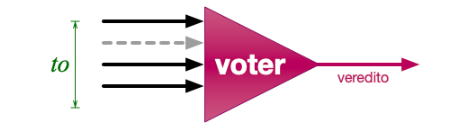

# Voter



## Especificação
O voter aguarda por **[ ve ]** mensagens **[ ve ]** é parâmetro do programa.

Ao receber a primeira mensagem, um timeout **[ to ]** deve ser agendado **[ to ]** também é parâmetro do programa).

Se recebe **[ ve ]** mensagens antes do fim do timeout, produz veredito e cancela timeout.

Se **[ to ]** expira, contabiliza o número de mensagens recebidas **[ vr (vr <= ve) ]** e produz veredito com base na maioria de **[ vr ]**.

A maioria é computada em Python por **[ math.ceil((vr+1)/2) ]**.

## How to run

SetUp

First install the dependencies
```bash
pip3 install -r requirements.txt 
```

1. First:

   Open a terminal and run:

```bash
pyro5-ns
```

2. Second 

    To start a server another terminal run:
    
    passing a server name as a parameter
```bash
python server.py <server-name>
```

3. Third
    To send a message to server in another terminal run passing a server name as parameter:
    * message can be null, if is will send a 'default_message'
```bash
python client.py <server-name> <message>
```